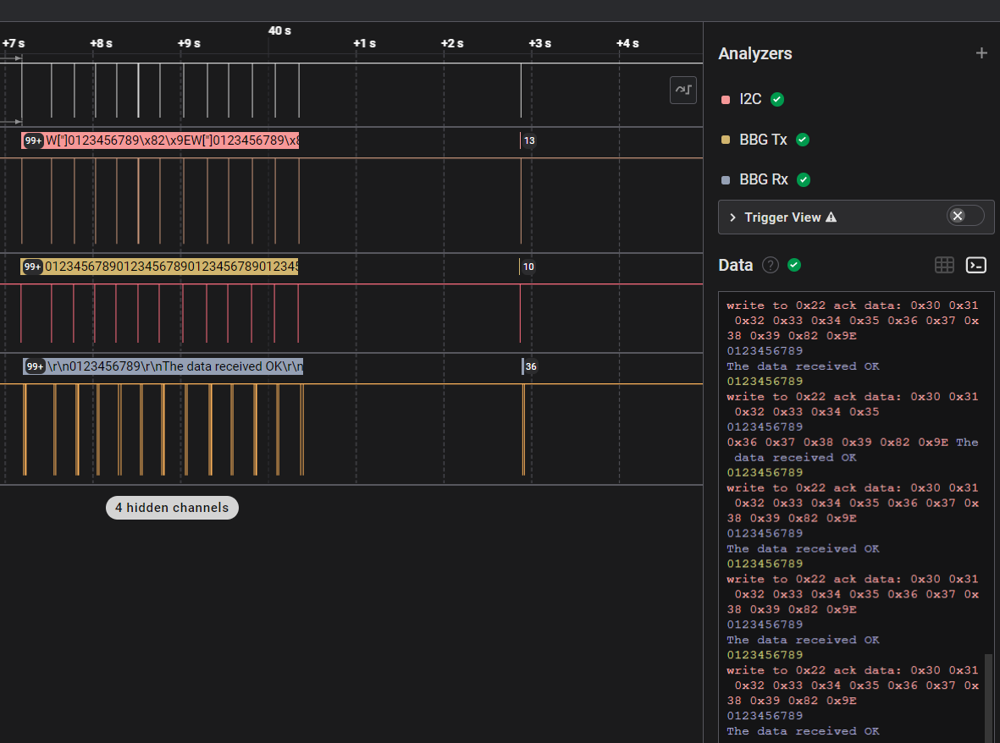

# BeagleBone Green UART I2C Loopback

This project implements a UART communication interface for BeagleBone Green (BBG) with CRC verification capabilities. It provides a simple command-line interface to send and receive data through UART, with options for CRC-protected data transmission.


## Overview

The BeagleBone Green UART I2C Loopback project demonstrates serial communication capabilities on the BeagleBone Green platform. It allows users to:

- Send raw data through UART
- Send data with CRC16-CCITT protection
- Receive data from UART
- Test communication with predefined character sequences
- Restart the UART interface as needed

This implementation is designed to work with the BBG's UART interfaces and can be used for testing communication between devices or as a foundation for more complex communication protocols.

## Features

- UART initialization with configurable baud rate (default: 115200)
- Data transmission with CRC16-CCITT verification
- Simple command-line interface for interaction
- Support for restarting UART connections
- Timeout-based read operations
- Error handling for communication failures

## Requirements

- BeagleBone Green board
- Linux environment with standard development tools
- GCC compiler
- Make build system

## Building the Project

To build the project, use the following commands:

```bash
git clone https://github.com/elkanamol/bbg_uart_i2c_loopback.git
cd bbg_uart_i2c_loopback
make
```

## Usage

After building the project, run the executable:

```bash
./bbg_uart_i2c_loopback
```

The program will present a menu with the following options:

1. Send data to UART
2. Send data with CRC to UART
3. Send 0-9 characters
4. Receive data from UART
5. Restart UART
6. Exit

Select an option by entering the corresponding number.

## Code Structure

- `src/main.c`: Main program logic and user interface
- `src/uart.c`: UART initialization and configuration
- `src/serials.c`: Serial communication functions
- `src/crc.c`: CRC16-CCITT calculation and verification
- `include/`: Header files for the project

## Technical Details

### UART Configuration

The UART is configured with the following settings:
- 8 data bits
- No parity
- 1 stop bit
- No hardware flow control
- Configurable baud rate (default: 115200)

### CRC Implementation

The project uses CRC16-CCITT with:
- Polynomial: 0x1021
- Initial value: 0xFFFF
- XOR value: 0xFFFF

## License

This project is licensed under the MIT License - see below for details:

```
MIT License

Copyright (c) 2025 Elkana Molson

Permission is hereby granted, free of charge, to any person obtaining a copy
of this software and associated documentation files (the "Software"), to deal
in the Software without restriction, including without limitation the rights
to use, copy, modify, merge, publish, distribute, sublicense, and/or sell
copies of the Software, and to permit persons to whom the Software is
furnished to do so, subject to the following conditions:

The above copyright notice and this permission notice shall be included in all
copies or substantial portions of the Software.

THE SOFTWARE IS PROVIDED "AS IS", WITHOUT WARRANTY OF ANY KIND, EXPRESS OR
IMPLIED, INCLUDING BUT NOT LIMITED TO THE WARRANTIES OF MERCHANTABILITY,
FITNESS FOR A PARTICULAR PURPOSE AND NONINFRINGEMENT. IN NO EVENT SHALL THE
AUTHORS OR COPYRIGHT HOLDERS BE LIABLE FOR ANY CLAIM, DAMAGES OR OTHER
LIABILITY, WHETHER IN AN ACTION OF CONTRACT, TORT OR OTHERWISE, ARISING FROM,
OUT OF OR IN CONNECTION WITH THE SOFTWARE OR THE USE OR OTHER DEALINGS IN THE
SOFTWARE.
```

## Contributing

Contributions to this project are welcome. Please feel free to submit a Pull Request.

## Author

Elkana Molson - [GitHub Profile](https://github.com/elkanamol)